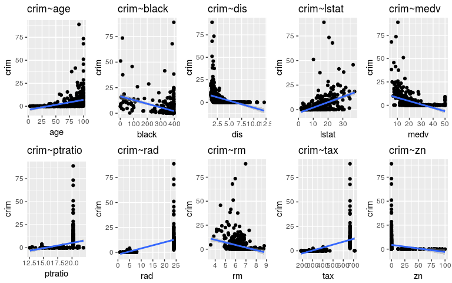
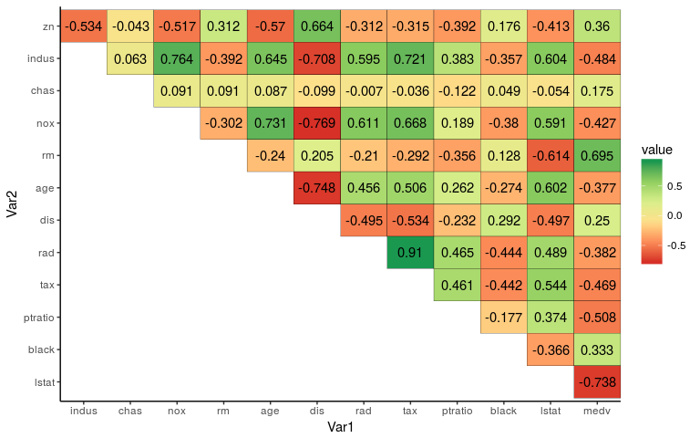

<h1> ISLR Ch3 Exercises #4, #15 </h1>

<h3> 
  4. I collect a set of data (`n = 100` observations) containing a single predictor and a quantitative response. I then fit a linear regression model to the data, as well as a separate cubic regression, i.e. $Y = \beta_{0}+\beta_{1}X+\beta_{2}X^{2}+\beta_{3}X^{3}+\epsilon$. 
</h3>

<h4> $(a)$ Suppose that the true relationship between `X` and `Y` is `linear`, i.e. $Y = \beta_0 + \beta_{1}X + \epsilon$. Consider the training residual sum of squares `(RSS)` for the linear regression, and also the training `RSS` for the cubic regression. Would we expect one to be lower than the other, would we expect them to be the same, or is there not enough information to tell? Justify your answer.</h4>

> We would expect `RSS` to be lower for the `cubic regression`.  This model is much more flexible and will allow for the line to be much closer to the training data set. 
# I feel like the RSS would be lower for the linear regression since we know that the true relationship is linear. I'm 100% sure though. 

<h4> $(b)$ Answer $(a)$ using test rather than training RSS. </h4>

> We would expect the `RSS` to be lower for the `linear regression`.  Since the true underlying relationship is linear the cubic regression is more likely to overpredict on the training set and therefor have a higher `RSS` for the test set.

<h4> $(c)$ Suppose that the true relationship between `X` and `Y` is not linear, but we don’t know how far it is from linear. Consider the training RSS for the linear regression, and also the training RSS for the cubic regression. Would we expect one to be lower than the other, would we expect them to be the same, or is there not enough information to tell? Justify your answer. </h4>

> The `cubic regression` model will perform better on the training set because it has greater degrees of freedom and the model is also non linear.

<h4> $(d)$ Answer $(c)$ using test rather than training RSS. </h4>

> It is very possible that the `cubic regression` model will perform better on the test rather than the training data than the `linear regression` model but.  If the `cubic regression` model is over trained on the training data then the `linear regerssion` model might strike a better line through the test data data and have a lower `RSS`


<h3> 15. This problem involves the `Boston` data set, which we saw in the lab for this chapter. We will now try to predict `per capita crime rate` using the other variables in this data set. In other words, `per capita crime rate` is the `response`, and the other variables are the predictors. </h3>


```r
Boston <- MASS::Boston
```

<h4>$(a)$ For each predictor, fit a simple linear regression model to predict the response. Describe your results. In which of the models is there a statistically significant association between the predictor and the response? Create some plots to back up your assertions.</h4>


```r
library(magrittr)
lm.age     <- Boston %$% lm(crim~age)
lm.black   <- Boston %$% lm(crim~black)
lm.chas    <- Boston %$% lm(crim~chas)
lm.dis     <- Boston %$% lm(crim~dis)
lm.indus   <- Boston %$% lm(crim~indus)
lm.lstat   <- Boston %$% lm(crim~lstat)
lm.medv    <- Boston %$% lm(crim~medv)
lm.nox     <- Boston %$% lm(crim~nox)
lm.ptratio <- Boston %$% lm(crim~ptratio)
lm.rad     <- Boston %$% lm(crim~rad)
lm.rm      <- Boston %$% lm(crim~rm)
lm.tax     <- Boston %$% lm(crim~tax)
lm.zn      <- Boston %$% lm(crim~zn)
```

> the following variables had a statistically signifigant associate between `crim` and themselves `age`, `black`, `dis`, `lstat`, `medv`, `ptratio`, `rad`, `rm`, `tax`, `zn`


#Nice grid of plots

<h4>$(b)$ Fit a multiple regression model to predict the response using all of the predictors. Describe your results. For which predictors can we reject the null hypothesis $H_0$ : $\beta_j = 0$?</h4>


```r
mult.reg.all <- lm(crim~., data=Boston)
pander(anova(mult.reg.all))
```


--------------------------------------------------------------
    &nbsp;       Df    Sum Sq   Mean Sq   F value    Pr(>F)   
--------------- ----- -------- --------- --------- -----------
    **zn**        1     1502     1502      36.21    3.457e-09 

   **indus**      1     4689     4689      113.1    6.469e-24 

   **chas**       1    247.8     247.8     5.976     0.01485  

    **nox**       1     1271     1271      30.65    5.041e-08 

    **rm**        1    138.5     138.5     3.341     0.0682   

    **age**       1    165.5     165.5     3.992     0.04628  

    **dis**       1    300.1     300.1     7.237    0.007383  

    **rad**       1     7238     7238      174.6    2.519e-34 

    **tax**       1    3.311     3.311    0.07984    0.7776   

  **ptratio**     1    7.281     7.281    0.1756     0.6754   

   **black**      1    455.3     455.3     10.98    0.000989  

   **lstat**      1    497.7     497.7      12      0.0005772 

   **medv**       1    447.9     447.9     10.8     0.001087  

 **Residuals**   492   20400     41.46      NA         NA     
--------------------------------------------------------------

Table: Analysis of Variance Table

> we can drop the following predictors, `tax`, `ptratio`.  `rm` is almost able to be rejected.  Next `chas` and `age` are on the chopping block.  Lastly `age` and `medv` also don't have \*\*\* signifigance

<h4>$(c)$ How do your results from $(a)$ compare to your results from $(b)$? Create a plot displaying the univariate regression coefficients from $(a)$ on the `x-axis`, and the multiple regression coefficients from $(b)$ on the `y-axis`. That is, each predictor is displayed as a single point in the plot. Its coefficient in a simple linear regression model is shown on the `x-axis`, and its coefficient estimate in the multiple linear regression model is shown on the `y-axis`.</h4>

<center>

<!--html_preserve--><div id="47175ba8cf85" style="width:672px;height:480px;" class="plotly html-widget"></div>
<script type="application/json" data-for="47175ba8cf85">{"x":{"data":[{"x":[-0.073934977404123,0.509776331104228,-1.89277655080378,31.2485312011229,-2.68405122411395,0.107786227139533,-1.5509016824101,0.617910927327201,0.0297422528227653,1.15198278707059,-0.0362796405673308,0.548804782062398,-0.363159922257603],"y":[0.0448552146700317,-0.0638548235877007,-0.749133610510599,-10.3135349120667,0.430130505864046,0.00145164343618213,-0.987175725502888,0.588208591473492,-0.00378001638485914,-0.271080558472251,-0.00753750488849206,0.1262113764595,-0.198886821265619],"text":["uni.reg.coef: -0.07393498<br />mult.reg.coef:   0.044855215<br />predictor: zn","uni.reg.coef:  0.50977633<br />mult.reg.coef:  -0.063854824<br />predictor: indus","uni.reg.coef: -1.89277655<br />mult.reg.coef:  -0.749133611<br />predictor: chas","uni.reg.coef: 31.24853120<br />mult.reg.coef: -10.313534912<br />predictor: nox","uni.reg.coef: -2.68405122<br />mult.reg.coef:   0.430130506<br />predictor: rm","uni.reg.coef:  0.10778623<br />mult.reg.coef:   0.001451643<br />predictor: age","uni.reg.coef: -1.55090168<br />mult.reg.coef:  -0.987175726<br />predictor: dis","uni.reg.coef:  0.61791093<br />mult.reg.coef:   0.588208591<br />predictor: rad","uni.reg.coef:  0.02974225<br />mult.reg.coef:  -0.003780016<br />predictor: tax","uni.reg.coef:  1.15198279<br />mult.reg.coef:  -0.271080558<br />predictor: ptratio","uni.reg.coef: -0.03627964<br />mult.reg.coef:  -0.007537505<br />predictor: black","uni.reg.coef:  0.54880478<br />mult.reg.coef:   0.126211376<br />predictor: lstat","uni.reg.coef: -0.36315992<br />mult.reg.coef:  -0.198886821<br />predictor: medv"],"type":"scatter","mode":"markers","marker":{"autocolorscale":false,"color":"rgba(0,0,0,1)","opacity":1,"size":5.66929133858268,"symbol":"circle-open","line":{"width":1.88976377952756,"color":"rgba(0,0,0,1)"}},"hoveron":"points","showlegend":false,"xaxis":"x","yaxis":"y","hoverinfo":"text","frame":null}],"layout":{"margin":{"t":26.2283105022831,"r":7.30593607305936,"b":40.1826484018265,"l":54.7945205479452},"plot_bgcolor":"rgba(255,255,255,1)","paper_bgcolor":"rgba(255,255,255,1)","font":{"color":"rgba(0,0,0,1)","family":"","size":14.6118721461187},"xaxis":{"domain":[0,1],"type":"linear","autorange":false,"range":[-4.3806803453758,32.9451603223848],"tickmode":"array","ticktext":["0","10","20","30"],"tickvals":[0,10,20,30],"categoryorder":"array","categoryarray":["0","10","20","30"],"nticks":null,"ticks":"outside","tickcolor":"rgba(51,51,51,1)","ticklen":3.65296803652968,"tickwidth":0.66417600664176,"showticklabels":true,"tickfont":{"color":"rgba(77,77,77,1)","family":"","size":11.689497716895},"tickangle":-0,"showline":true,"linecolor":"rgba(0,0,0,1)","linewidth":0.66417600664176,"showgrid":false,"gridcolor":null,"gridwidth":0,"zeroline":false,"anchor":"y","title":"uni.reg.coef","titlefont":{"color":"rgba(0,0,0,1)","family":"","size":14.6118721461187},"hoverformat":".2f"},"yaxis":{"domain":[0,1],"type":"linear","autorange":false,"range":[-10.8586220872437,1.1332957666505],"tickmode":"array","ticktext":["-10.0","-7.5","-5.0","-2.5","0.0"],"tickvals":[-10,-7.5,-5,-2.5,0],"categoryorder":"array","categoryarray":["-10.0","-7.5","-5.0","-2.5","0.0"],"nticks":null,"ticks":"outside","tickcolor":"rgba(51,51,51,1)","ticklen":3.65296803652968,"tickwidth":0.66417600664176,"showticklabels":true,"tickfont":{"color":"rgba(77,77,77,1)","family":"","size":11.689497716895},"tickangle":-0,"showline":true,"linecolor":"rgba(0,0,0,1)","linewidth":0.66417600664176,"showgrid":false,"gridcolor":null,"gridwidth":0,"zeroline":false,"anchor":"x","title":"mult.reg.coef","titlefont":{"color":"rgba(0,0,0,1)","family":"","size":14.6118721461187},"hoverformat":".2f"},"shapes":[{"type":"rect","fillcolor":null,"line":{"color":null,"width":0,"linetype":[]},"yref":"paper","xref":"paper","x0":0,"x1":1,"y0":0,"y1":1}],"showlegend":false,"legend":{"bgcolor":"rgba(255,255,255,1)","bordercolor":"transparent","borderwidth":1.88976377952756,"font":{"color":"rgba(0,0,0,1)","family":"","size":11.689497716895}},"hovermode":"closest","barmode":"relative"},"config":{"doubleClick":"reset","modeBarButtonsToAdd":[{"name":"Collaborate","icon":{"width":1000,"ascent":500,"descent":-50,"path":"M487 375c7-10 9-23 5-36l-79-259c-3-12-11-23-22-31-11-8-22-12-35-12l-263 0c-15 0-29 5-43 15-13 10-23 23-28 37-5 13-5 25-1 37 0 0 0 3 1 7 1 5 1 8 1 11 0 2 0 4-1 6 0 3-1 5-1 6 1 2 2 4 3 6 1 2 2 4 4 6 2 3 4 5 5 7 5 7 9 16 13 26 4 10 7 19 9 26 0 2 0 5 0 9-1 4-1 6 0 8 0 2 2 5 4 8 3 3 5 5 5 7 4 6 8 15 12 26 4 11 7 19 7 26 1 1 0 4 0 9-1 4-1 7 0 8 1 2 3 5 6 8 4 4 6 6 6 7 4 5 8 13 13 24 4 11 7 20 7 28 1 1 0 4 0 7-1 3-1 6-1 7 0 2 1 4 3 6 1 1 3 4 5 6 2 3 3 5 5 6 1 2 3 5 4 9 2 3 3 7 5 10 1 3 2 6 4 10 2 4 4 7 6 9 2 3 4 5 7 7 3 2 7 3 11 3 3 0 8 0 13-1l0-1c7 2 12 2 14 2l218 0c14 0 25-5 32-16 8-10 10-23 6-37l-79-259c-7-22-13-37-20-43-7-7-19-10-37-10l-248 0c-5 0-9-2-11-5-2-3-2-7 0-12 4-13 18-20 41-20l264 0c5 0 10 2 16 5 5 3 8 6 10 11l85 282c2 5 2 10 2 17 7-3 13-7 17-13z m-304 0c-1-3-1-5 0-7 1-1 3-2 6-2l174 0c2 0 4 1 7 2 2 2 4 4 5 7l6 18c0 3 0 5-1 7-1 1-3 2-6 2l-173 0c-3 0-5-1-8-2-2-2-4-4-4-7z m-24-73c-1-3-1-5 0-7 2-2 3-2 6-2l174 0c2 0 5 0 7 2 3 2 4 4 5 7l6 18c1 2 0 5-1 6-1 2-3 3-5 3l-174 0c-3 0-5-1-7-3-3-1-4-4-5-6z"},"click":"function(gd) { \n        // is this being viewed in RStudio?\n        if (location.search == '?viewer_pane=1') {\n          alert('To learn about plotly for collaboration, visit:\\n https://cpsievert.github.io/plotly_book/plot-ly-for-collaboration.html');\n        } else {\n          window.open('https://cpsievert.github.io/plotly_book/plot-ly-for-collaboration.html', '_blank');\n        }\n      }"}],"cloud":false},"source":"A","attrs":{"47176e1eb991":{"x":{},"y":{},"label":{},"type":"scatter"}},"cur_data":"47176e1eb991","visdat":{"47176e1eb991":["function (y) ","x"]},"highlight":{"on":"plotly_click","persistent":false,"dynamic":false,"selectize":false,"opacityDim":0.2,"selected":{"opacity":1}},"base_url":"https://plot.ly"},"evals":["config.modeBarButtonsToAdd.0.click"],"jsHooks":{"render":[{"code":"function(el, x) { var ctConfig = crosstalk.var('plotlyCrosstalkOpts').set({\"on\":\"plotly_click\",\"persistent\":false,\"dynamic\":false,\"selectize\":false,\"opacityDim\":0.2,\"selected\":{\"opacity\":1}}); }","data":null}]}}</script><!--/html_preserve-->
</center>

> from the plot you can see that `nox` is varies quite a lot from the `univariate regression coefficients` {$31.25$} to the `multivariate regression coefficients` {$-10.32$}

<h4>(d) Is there evidence of non-linear association between any of the predictors and the response? To answer this question, for each predictor X, fit a model of the form $Y = \beta_{0} + \beta_{1}{X} + \beta_{2}{X}^{2} + \beta_{3}{X}^{3} + \epsilon$.</h4>



The colors represent how far apart two `predictors` are from eachother.  For example when `lstat` is high `medv` is low.  And when `rad` is high `tax` is also high.  The more red something is the more they differ, and the more green something is the more they are simmilar.  Yellow indicates that there is almost no correlation between the two variables.

<h5>$age.$</h5>


```r
lm.age.d <- Boston %$% lm(crim~poly(age,3))
pander(summary(lm.age.d)$coefficients)
```


-----------------------------------------------------------------
      &nbsp;         Estimate   Std. Error   t value   Pr(>|t|)  
------------------- ---------- ------------ --------- -----------
  **(Intercept)**     3.614       0.3485      10.37    5.919e-23 

 **poly(age, 3)1**    68.18        7.84       8.697    4.879e-17 

 **poly(age, 3)2**    37.48        7.84       4.781    2.291e-06 

 **poly(age, 3)3**    21.35        7.84       2.724     0.00668  
-----------------------------------------------------------------
> the cubic polynomial is not statistically signifigant

<h5>$black.$</h5>


```r
lm.black.d <- Boston %$% lm(crim~poly(black,3))
pander(summary(lm.black.d)$coefficients)
```


------------------------------------------------------------------
       &nbsp;          Estimate   Std. Error   t value   Pr(>|t|) 
--------------------- ---------- ------------ --------- ----------
   **(Intercept)**      3.614       0.3536      10.22    2.14e-22 

 **poly(black, 3)1**    -74.43      7.955      -9.357    2.73e-19 

 **poly(black, 3)2**    5.926       7.955       0.745     0.4566  

 **poly(black, 3)3**    -4.835      7.955      -0.6078    0.5436  
------------------------------------------------------------------

> the cubic coefficient is not statistically signifigant

<h5>$chas.$</h5>


```r
lm.chas.d <- Boston %$% lm(crim~poly(chas,1))
pander(summary(lm.chas.d)$coefficients)
```


-----------------------------------------------------------------
      &nbsp;         Estimate   Std. Error   t value   Pr(>|t|)  
------------------- ---------- ------------ --------- -----------
  **(Intercept)**     3.614       0.3822      9.455    1.216e-19 

 **poly(chas, 1)**    -10.8       8.597      -1.257     0.2094   
-----------------------------------------------------------------

> can only be evaulated to one degree because `chas` is a boolean variable (1's and 0's) and it is not statistically signifigant

<h5>$dis.$</h5>


```r
lm.dis.d <- Boston %$% lm(crim~poly(dis,3))
pander(summary(lm.dis.d)$coefficients)
```


-----------------------------------------------------------------
      &nbsp;         Estimate   Std. Error   t value   Pr(>|t|)  
------------------- ---------- ------------ --------- -----------
  **(Intercept)**     3.614       0.3259      11.09    1.06e-25  

 **poly(dis, 3)1**    -73.39      7.331      -10.01    1.253e-21 

 **poly(dis, 3)2**    56.37       7.331       7.689    7.87e-14  

 **poly(dis, 3)3**    -42.62      7.331      -5.814    1.089e-08 
-----------------------------------------------------------------

> all three polynomials are statistically signifigant

<h5>$indus.$</h5>


```r
lm.indus.d <- Boston %$% lm(crim~poly(indus,3))
pander(summary(lm.indus.d)$coefficients)
```


-------------------------------------------------------------------
       &nbsp;          Estimate   Std. Error   t value   Pr(>|t|)  
--------------------- ---------- ------------ --------- -----------
   **(Intercept)**      3.614        0.33       10.95    3.606e-25 

 **poly(indus, 3)1**    78.59       7.423       10.59    8.854e-24 

 **poly(indus, 3)2**    -24.39      7.423      -3.286    0.001086  

 **poly(indus, 3)3**    -54.13      7.423      -7.292    1.196e-12 
-------------------------------------------------------------------
> the square polynomial is not statistically signifigant

<h5>$lstat.$</h5>


```r
lm.lstat.d <- Boston %$% lm(crim~poly(lstat,3))
pander(summary(lm.lstat.d)$coefficients)
```


-------------------------------------------------------------------
       &nbsp;          Estimate   Std. Error   t value   Pr(>|t|)  
--------------------- ---------- ------------ --------- -----------
   **(Intercept)**      3.614       0.3392      10.65    4.939e-24 

 **poly(lstat, 3)1**    88.07       7.629       11.54    1.678e-27 

 **poly(lstat, 3)2**    15.89       7.629       2.082     0.0378   

 **poly(lstat, 3)3**    -11.57      7.629      -1.517     0.1299   
-------------------------------------------------------------------

> the square and cubic polynomials are not statistically signifigant

<h5>$medv.$</h5>


```r
lm.medv.d <- Boston %$% lm(crim~poly(medv,3))
pander(summary(lm.medv.d)$coefficients)
```


------------------------------------------------------------------
       &nbsp;         Estimate   Std. Error   t value   Pr(>|t|)  
-------------------- ---------- ------------ --------- -----------
  **(Intercept)**      3.614       0.292       12.37    7.024e-31 

 **poly(medv, 3)1**    -75.06      6.569      -11.43    4.931e-27 

 **poly(medv, 3)2**    88.09       6.569       13.41    2.929e-35 

 **poly(medv, 3)3**    -48.03      6.569      -7.312    1.047e-12 
------------------------------------------------------------------

> all three polynomials are statistically signifigant

<h5>$nox.$</h5>


```r
lm.nox.d <- Boston %$% lm(crim~poly(nox,3))
pander(summary(lm.nox.d)$coefficients)
```


-----------------------------------------------------------------
      &nbsp;         Estimate   Std. Error   t value   Pr(>|t|)  
------------------- ---------- ------------ --------- -----------
  **(Intercept)**     3.614       0.3216      11.24    2.743e-26 

 **poly(nox, 3)1**    81.37       7.234       11.25    2.457e-26 

 **poly(nox, 3)2**    -28.83      7.234      -3.985    7.737e-05 

 **poly(nox, 3)3**    -60.36      7.234      -8.345    6.961e-16 
-----------------------------------------------------------------

> all three polynomials are statistically signifigant

<h5>$ptratio.$</h5>


```r
lm.ptratio.d <- Boston %$% lm(crim~poly(ptratio,3))
pander(summary(lm.ptratio.d)$coefficients)
```


---------------------------------------------------------------------
        &nbsp;           Estimate   Std. Error   t value   Pr(>|t|)  
----------------------- ---------- ------------ --------- -----------
    **(Intercept)**       3.614       0.361       10.01    1.271e-21 

 **poly(ptratio, 3)1**    56.05       8.122       6.901    1.565e-11 

 **poly(ptratio, 3)2**    24.77       8.122       3.05     0.002405  

 **poly(ptratio, 3)3**    -22.28      8.122      -2.743    0.006301  
---------------------------------------------------------------------

> the cubic polynomial is not statistically signifigant, and the square polynomial is barely statistically signifigant

<h5>$rad.$</h5>


```r
lm.rad.d <- Boston %$% lm(crim~poly(rad,3))
pander(summary(lm.rad.d)$coefficients)
```


-----------------------------------------------------------------
      &nbsp;         Estimate   Std. Error   t value   Pr(>|t|)  
------------------- ---------- ------------ --------- -----------
  **(Intercept)**     3.614       0.2971      12.16    5.15e-30  

 **poly(rad, 3)1**    120.9       6.682       18.09    1.053e-56 

 **poly(rad, 3)2**    17.49       6.682       2.618    0.009121  

 **poly(rad, 3)3**    4.698       6.682      0.7031     0.4823   
-----------------------------------------------------------------

> the cubic polynomial is not statistically signifigant, and the square polynomial is barely statistically signifigant, less so than for ptratio

<h5>$rm.$</h5>


```r
lm.rm.d <- Boston %$% lm(crim~poly(rm,3))
pander(summary(lm.rm.d)$coefficients)
```


----------------------------------------------------------------
      &nbsp;        Estimate   Std. Error   t value   Pr(>|t|)  
------------------ ---------- ------------ --------- -----------
 **(Intercept)**     3.614       0.3703      9.758    1.027e-20 

 **poly(rm, 3)1**    -42.38       8.33      -5.088    5.128e-07 

 **poly(rm, 3)2**    26.58        8.33       3.191    0.001509  

 **poly(rm, 3)3**    -5.51        8.33      -0.6615    0.5086   
----------------------------------------------------------------

> the cubic polynomial is not statistically signifigant, and the square polynomial is just almost statistically signifigant but not quite


<h5>$tax.$</h5>


```r
lm.tax.d <- Boston %$% lm(crim~poly(tax,3))
pander(summary(lm.tax.d)$coefficients)
```


-----------------------------------------------------------------
      &nbsp;         Estimate   Std. Error   t value   Pr(>|t|)  
------------------- ---------- ------------ --------- -----------
  **(Intercept)**     3.614       0.3047      11.86    8.956e-29 

 **poly(tax, 3)1**    112.6       6.854       16.44    6.976e-49 

 **poly(tax, 3)2**    32.09       6.854       4.682    3.665e-06 

 **poly(tax, 3)3**    -7.997      6.854      -1.167     0.2439   
-----------------------------------------------------------------

> the cubic polynomial is not statistically signifigant

<h5>$zn.$</h5>


```r
lm.zn.d <- Boston %$% lm(crim~poly(zn,3))
pander(summary(lm.zn.d)$coefficients)
```


----------------------------------------------------------------
      &nbsp;        Estimate   Std. Error   t value   Pr(>|t|)  
------------------ ---------- ------------ --------- -----------
 **(Intercept)**     3.614       0.3722      9.709    1.547e-20 

 **poly(zn, 3)1**    -38.75      8.372      -4.628    4.698e-06 

 **poly(zn, 3)2**    23.94       8.372       2.859    0.004421  

 **poly(zn, 3)3**    -10.07      8.372      -1.203     0.2295   
----------------------------------------------------------------

> the cubic polynomial is not statistically signifigant, and the square polynomial is almost statistically signifigant

> There is a possibility of a non linear relationship for `indus`, `medv` and,  `nox` with `crim`.
`
